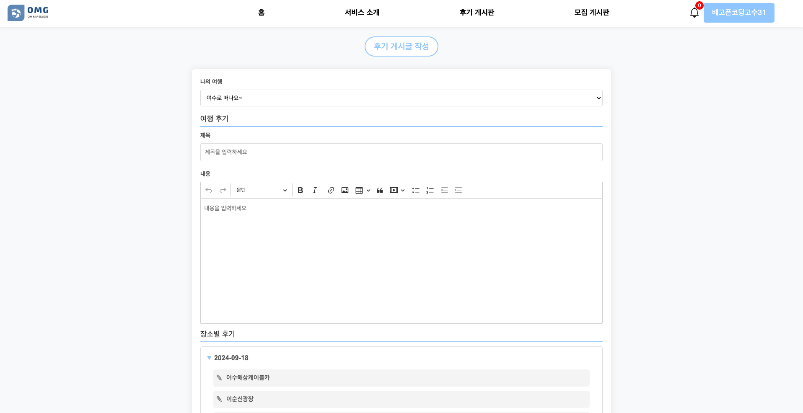
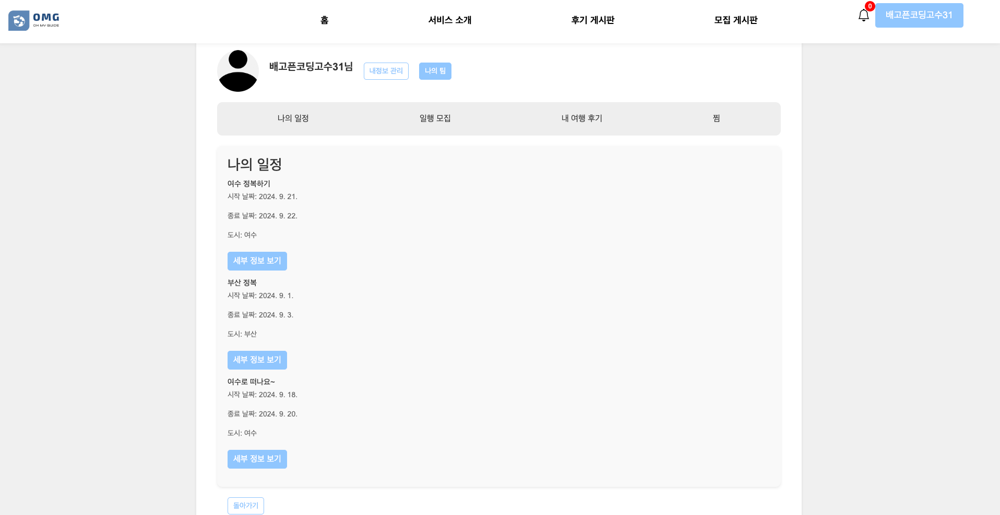
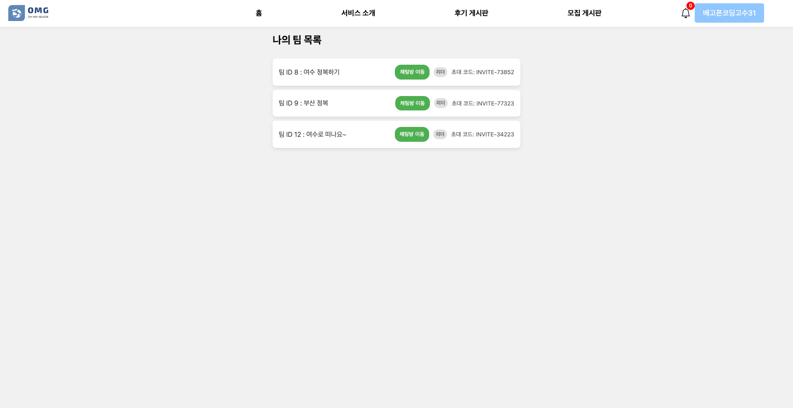

# OMG (Oh My Guide)
- omg 접속 주소 : http://43.202.189.185:8080/

## 팀 소개 (Team)

## 👨‍👨‍👦‍👦 팀원

|                                               [전현진](https://github.com/HyeonJinJeon)                                                |                                                    [곽유진](https://github.com/jinijavac)                                                     |                                                    [손설빈](https://github.com/seolbb)                                                     |                                                    [김혜주](https://github.com/kimoju01)                                                     |                                                    [박경서](https://github.com/kyongseo)                                                     |
|:---------------------------------------------------------------------------------------------------------------------------------:|:---------------------------------------------------------------------------------------------------------------------------------:|:---------------------------------------------------------------------------------------------------------------------------------:|:---------------------------------------------------------------------------------------------------------------------------------:|:---------------------------------------------------------------------------------------------------------------------------------:|
|  |  |  |  |  | 
|                                                                팀장                                                                 |                                                                팀원                                                                 |                                                                팀원                                                                 |                                                                팀원                                                                 |                                                                팀원                                                                 | 


**목차**

1. [프로젝트 개요 (Overview)](#프로젝트-개요-overview)
2. [기술 스택 (Tech Stack)](#기술-스택-tech-stack)
3. [설치 및 실행 방법 (Installation & Setup)](#설치-및-실행-방법-installation--setup)
4. [주요 기능 (Features)](#주요-기능-features)
5. [프로젝트 구조 (Project Structure)](#프로젝트-구조-project-structure)
6. [데모 (Demo)](#데모-demo)
7. [테스트 (Testing)](#테스트-testing)
8. [기여 방법 (Contributing)](#기여-방법-contributing)
9. [라이선스 (License)](#라이선스-license)
10. [문제 해결 (Troubleshooting) 및 FAQ](#문제-해결-troubleshooting-및-faq)
11. [향후 계획 (Future Work)](#향후-계획-future-work)
12. [기타 참고 자료 (Additional Resources)](#기타-참고-자료-additional-resources)
---

## 프로젝트 개요 (Overview)

OMG(Oh My Guide)는 사용자가 **여행을 계획**하고 **동행자를 모집**하며, **여행 후기를 공유**할 수 있는 종합 여행 지원 플랫폼입니다. 이 프로젝트는 사용자에게 맞춤형 여행 일정을 제공하고, 실시간 소통 기능을 통해 보다 원활하고 즐거운 여행 경험을 제공하도록 설계되었습니다.

- **문제 정의**:

  여행을 계획하는 과정은 복잡하고 시간 소모적입니다. 또한, 동행자를 찾고 함께 소통하는 것 또한 쉽지 않습니다. 여행 후기를 나누는 과정에서도 정보의 교류가 제한적일 수 있습니다.

- **해결 방안**:

  OMG는 사용자의 개인화된 여행 일정을 제안하고, 동행자를 모집할 수 있는 기능을 제공합니다. 또한, 실시간 채팅 및 커뮤니티 기능을 통해 사용자들이 여행 후기를 쉽게 공유하고 소통할 수 있도록 지원합니다.


---

## 기술 스택 (Tech Stack)

**프론트엔드**

- **Thymeleaf**: 서버 사이드 템플릿 엔진으로, 동적인 HTML 콘텐츠를 생성하여 사용자에게 제공.

**백엔드**

- **Java**: 애플리케이션 로직 구현을 위한 주요 언어.
- **Kafka**: 실시간 채팅 기능 구현을 위한 메시징 시스템.
- **Redis**: 알림 기능 및 세션 관리 용도로 사용되는 인메모리 데이터베이스.

**데이터베이스**

- **MySQL**: 데이터 저장 및 관리 용도로 사용하는 관계형 데이터베이스 관리 시스템.

**배포 및 인프라**

- **Docker**: 애플리케이션 및 서비스의 컨테이너화.
- **GithubAction**: CI/CD 파이프라인을 통한 자동화된 빌드 및 배포.
- **Jenkins**: CI/CD 파이프라인을 통한 자동화된 빌드 및 배포.

**기타**

- **IntelliJ IDEA**: 개발 환경으로 사용.
- **kakaomap API**: 여행 위치 정보 제공.
- **Tour API**: 여행지 관련 정보 제공.
- **Weather API**: 날씨 정보 제공.
- **Channel API**: 소통 및 알림 기능 제공.

---

## 설치 및 실행 방법 (Installation & Setup)

### 필수 설치 도구

- **Java 21 버전**: [Java 다운로드 링크](https://www.oracle.com/java/technologies/javase-jdk21-downloads.html)
- **Docker**: [Docker 설치 가이드](https://docs.docker.com/get-docker/)

### 실행 단계

1. **필수 도구 설치**: 위의 링크를 통해 Java 21 버전 및 Docker를 설치합니다.

2. **`docker-compose.yml` 파일 작성**: 프로젝트 디렉토리에 `docker` 폴더를 생성하고, 각 서비스에 맞는 하위 폴더와 `docker-compose.yml` 파일을 작성합니다.

    - **Kafka 폴더 및 `docker-compose.yml` 파일**

      `docker/kafka/docker-compose.yml` 파일 내용:

      ```yaml
      services:
        zookeeper:
          image: bitnami/zookeeper:latest
          ports:
            - "2181:2181"
          environment:
            - ALLOW_ANONYMOUS_LOGIN=yes
 
        kafka:
          image: bitnami/kafka:latest
          ports:
            - "9092:9092"
          environment:
            - KAFKA_CFG_ZOOKEEPER_CONNECT=zookeeper:2181
            - ALLOW_PLAINTEXT_LISTENER=yes
            - KAFKA_CFG_LISTENERS=PLAINTEXT://:9092
            - KAFKA_CFG_ADVERTISED_LISTENERS=PLAINTEXT://localhost:9092
          depends_on:
            - zookeeper
      ```

    - **Redis 폴더 및 `docker-compose.yml` 파일**

      `docker/redis/docker-compose.yml` 파일 내용:

      ```yaml
      services:
        redis:
          image: redis:latest
          container_name: redis
          command: ["redis-server", "--requirepass", "1234"]
          ports:
            - "6379:6379"
          volumes:
            - ./redis-data:/data
      volumes:
        redis-data:
      ```

    - **MySQL 폴더 및 `docker-compose.yml` 파일**

      `docker/mysql/docker-compose.yml` 파일 내용:

      ```yaml
      services:
        vacation-db:
          image: mysql
          restart: always
          environment:
            MYSQL_ROOT_PASSWORD: "1234"
            MYSQL_DATABASE: "example"
            MYSQL_USER: "your_username"
            MYSQL_PASSWORD: "your_password"
          command:
            - "--character-set-server=utf8mb4"
            - "--collation-server=utf8mb4_unicode_ci"
          volumes:
            - "./database/init:/docker-entrypoint-initdb.d/"
            - "./database/datadir:/var/lib/mysql"
          platform: linux/x86_64
          ports:
            - "3306:3306"
      ```

3. **Docker 컨테이너 실행**: 터미널에서 각 서비스의 폴더로 이동하여 Docker Compose 명령어를 실행합니다.

   ```bash
   # Kafka 서비스 실행
   cd docker/kafka
   docker-compose up -d

   # Redis 서비스 실행
   cd ../redis
   docker-compose up -d

   # MySQL 서비스 실행
   cd ../mysql
   docker-compose up -d

4. **데이터베이스에 데이터 추가**: local에서 처음으로 프로젝트를 진행하려고 할 때 city와 role에 관한 초기 데이터를 추가합니다.
    ```sql
    INSERT INTO cities (name) VALUES ('서울'), ('부산'), ('대구'), ('인천'), ('광주'), ('대전'), ('울산'), ('세종'), ('춘천'), ('원주'), ('강릉'), ('동해'), ('태백'), ('속초'), ('삼척'), ('홍천'), ('횡성'), ('평창'), ('정선'), ('영월'), ('수원'), ('고양'), ('용인'), ('성남'), ('부천'), ('남양주'), ('안산'), ('안양'), ('평택'), ('의정부'), ('군포'), ('오산'), ('시흥'), ('하남'), ('의왕'), ('양주'), ('파주'), ('광명'), ('구리'), ('여주'), ('창원'), ('김해'), ('진주'), ('양산'), ('거제'), ('통영'), ('사천'), ('밀양'), ('함안'), ('거창'), ('창녕'), ('산청'), ('의령'), ('고성'), ('하동'), ('합천'), ('포항'), ('경주'), ('구미'), ('김천'), ('안동'), ('영주'), ('상주'), ('문경'), ('경산'), ('영천'), ('청송'), ('영양'), ('봉화'), ('울릉'), ('예천'), ('성주'), ('군위'), ('의성'), ('천안'), ('아산'), ('서산'), ('공주'), ('보령'), ('논산'), ('계룡'), ('당진'), ('홍성'), ('예산'), ('서천'), ('청양'), ('부여'), ('금산'), ('청주'), ('충주'), ('제천'), ('단양'), ('음성'), ('진천'), ('괴산'), ('보은'), ('옥천'), ('영동'), ('여수'), ('순천'), ('목포'), ('나주'), ('광양'), ('담양'), ('곡성'), ('구례'), ('고흥'), ('보성'), ('장흥'), ('강진'), ('해남'), ('완도'), ('진도'), ('신안'), ('무안'), ('영암'), ('전주'), ('군산'), ('익산'), ('남원'), ('정읍'), ('김제'), ('완주'), ('진안'), ('무주'), ('장수'), ('고창'), ('임실'), ('순창'), ('제주'), ('서귀포');
    ```
    ```sql
   INSERT INTO roles (id, name) VALUES (1, 'ROLE_ADMIN');
    INSERT INTO roles (id, name) VALUES (2, 'ROLE_USER');
    ```
---

## 주요 기능 (Features)

- **맞춤형 여행 일정 제공**: 사용자의 여행 선호에 맞춘 일정을 추천.
- **여행 크루 모집**: 동행자를 모집하고 커뮤니티 기능을 통해 소통.
- **일정 공유**: 친구나 가족과 여행 일정을 공유.
- **여행 플래너**: 여행 일정을 계획하고 관리할 수 있는 기능 제공.
- **여행 리뷰**: 여행 후기를 게시판에 공유하고 다른 사용자들과 소통.

---

## 프로젝트 구조 (Project Structure)

    /src                            # 소스 코드 루트 디렉토리
    └── /domain                     # 도메인 모델 정의 관련 코드
        ├── /config                 # 도메인 관련 설정 파일들
        ├── /controller             # 컨트롤러 레이어 (API 엔드포인트)
        ├── /service                # 서비스 레이어 (비즈니스 로직)
        │   └── /impl               # 서비스 구현체
        ├── /repository             # 데이터베이스 접근 레이어 (DAO)
        ├── /dto                    # 데이터 전송 객체 (Data Transfer Objects)
        └── /entity                 # 엔티티 클래스 (DB 매핑 객체)
    
    └── /global                     # 글로벌 설정 및 공통 유틸리티
        ├── /config                 # 전역 설정 파일들
        ├── /exception              # 전역 예외 처리 클래스
        ├── /image                  # 이미지 처리 유틸리티
        ├── /jwt                    # JWT 관련 유틸리티 및 구성
        ├── /oauth2                 # OAuth2 관련 유틸리티 및 구성
        └── /security               # 보안 관련 설정 및 유틸리티


## 데모 (Demo)

### 로그인


### 회원가입


### 메인 페이지


### 여행 일정 생성 방법 선택


### 일정 생성
#### - 직접 생성

#### - 기존 일정 참여


### 일정 상세


### 게시판
#### - 게시글 목록 (모집 게시글 목록도 동일)


#### - 후기 게시글 작성



#### - 모집 게시글 작성


### 찜하기


### 내 정보(생성한 일정 및 작성한 글 목록)




### 채팅 


### 알림


### 관리자


---

## 기여 방법 (Contributing)

- **이슈 제출**: 명확한 제목과 설명으로 이슈를 제출합니다.
- **Pull Request (PR) 작성**:
    - **제목 형식**: `[#[이슈번호]] 제목` 형식으로 작성합니다.
    - **설명**: 변경 사항과 관련된 정보를 상세히 기술합니다.
    - **체크리스트**: 코드 스타일 가이드 준수, 테스트 작성 등 확인.
- **코드 스타일 가이드**:
    - **Indentation**: 공백 4칸.
    - **Naming Conventions**: camelCase, PascalCase 등 사용.
    - **Braces**: 새 줄에 작성.
    - **Comments**: 주요 로직에 주석 추가.
    - **Error Handling**: 예외 처리 및 로그 작성.

---

## 문제 해결 (Troubleshooting) 및 FAQ

- **자주 발생하는 문제**:
    - Docker 컨테이너가 시작되지 않는 경우: Docker 로그를 확인하고 필요한 설정을 검토하세요.
    - MySQL 연결 문제: 데이터베이스 설정과 사용자 인증 정보를 확인하세요.
- **FAQ**:
    - **Q**: 프로젝트를 실행하는데 필요한 필수 소프트웨어는 무엇인가요?**A**: Java 21, Docker, MySQL, Redis, Kafka가 필요합니다.
    - **Q**: 오류가 발생했을 때 어떻게 해결하나요?**A**: 오류 로그를 확인하고 문제를 추적하세요. 필요시 GitHub Issues를 통해 도움을 요청할 수 있습니다.

---

## 향후 계획 (Future Work)

- **추가 기능 개발**: 새로운 여행지 추천 기능 및 사용자 리뷰 분석 알고리즘 개선.
- **성능 최적화**: 실시간 채팅 기능의 성능 향상 및 확장성 개선.
- **UI/UX 개선**: 사용자 경험을 향상시키기 위한 인터페이스 개편.

---

## 기타 참고 자료 (Additional Resources)

- [Java Documentation](https://docs.oracle.com/en/java/)
- Docker Documentation
- Thymeleaf Documentation
- [Kafka Documentation](https://kafka.apache.org/documentation/)
- Redis Documentation

---